### 关于本分类

这个分类用来放我在学校云计算课程学习的内容，主要是根据上课所讲再按照**自己的理解**所写

本系列文章均为在**Windows**（我自己使用Windows11专业版金丝雀分支）操作，如有例外会特别声明

## 00 开始之前的准备

1. 一个有效的**VMware Workstation Pro**（以后都简称**VMW**）安装，并确保其可执行文件在**系统PATH**中
    - 此处使用学校提供的VMW 17.6.1版本
    - 由于现在**个人使用都已经免费**了，怎么安装VMW本文就不在赘述了
2. 一个**RedHat 9.3**的**ISO镜像**，用于创建虚拟机
    - 此处我使用学校提供的镜像，如果你没有可以尝试去RedHat官网或者其他地方下一个

## 01 创建虚拟机

首先打开你的**VMware Workstation Pro**，然后点击**创建新的虚拟机**

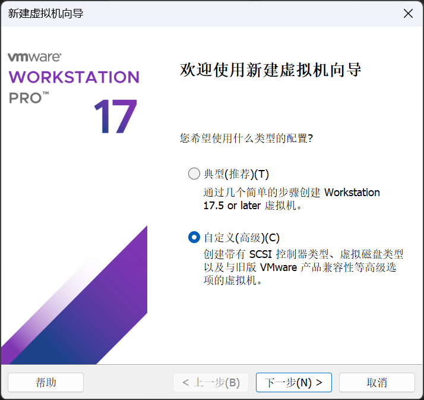

保持默认选择`自定义(高级)`即可，然后下一步

下一页面`选择虚拟机硬件兼容性`也保持默认即可，下一步

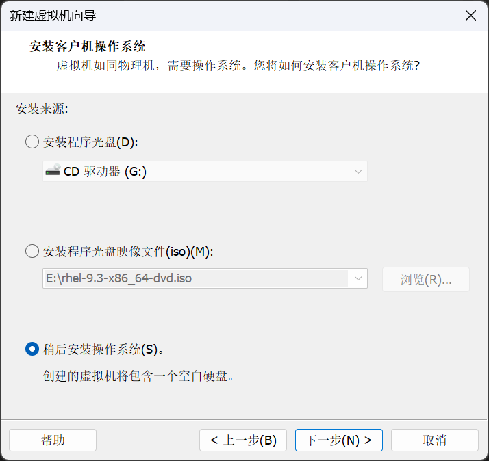

这个页面保持默认选择`稍后安装操作系统`，我们使用手动安装以熟悉流程，然后下一步

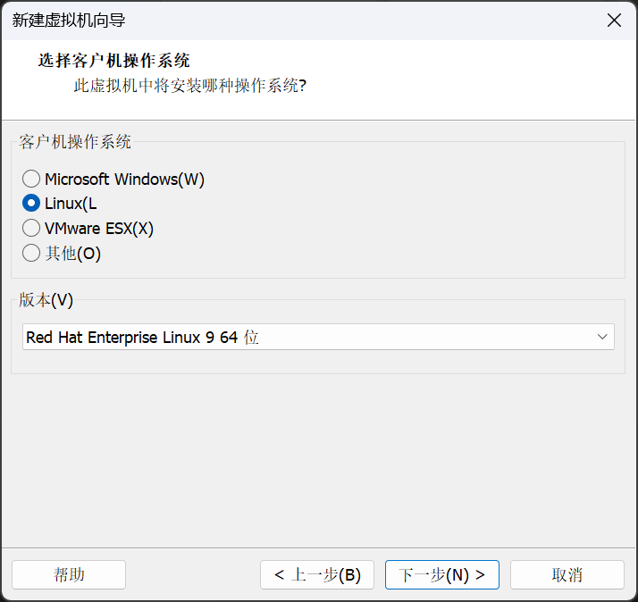

此处`客户机操作系统`分类选择`Linux`，`版本`选择`Red Hat Enterprise Linux X 64位`此处`X`为你用的Redhat镜像的**大版本**，如果没有你用的版本(比如太新)就直接选上图一样的`9`就行，完成后下一步

下一步是`命名虚拟机`，按照自己的习惯命名就是，然后找个你自己容易找到的地方存放虚拟机文件，注意**路径最好不要有中文**，然后继续

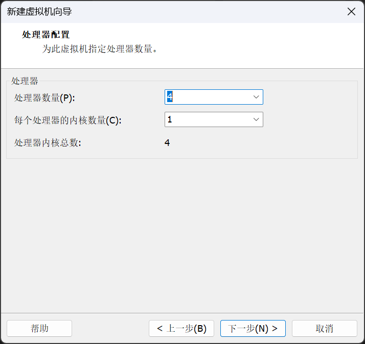

此处按**你电脑实际配置**改`处理器数量`（核心数）以及`每个处理器的内核数量`（线程数），此处根据我电脑的实际配置使用上图的处理器配置，继续

下个页面配置分配给虚拟机的运行内存

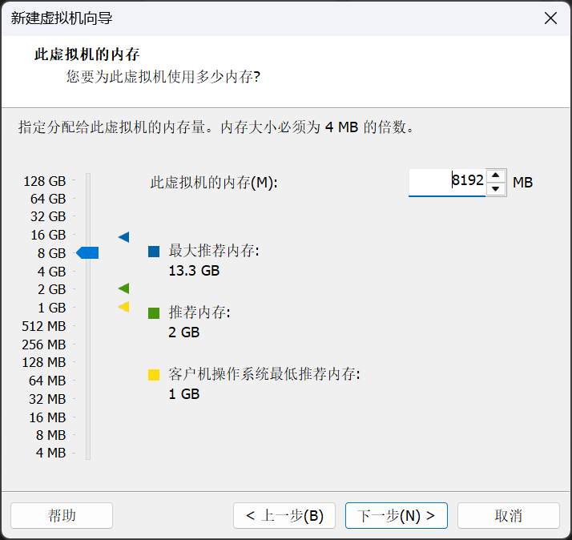

依旧根据自己电脑实际配置修改，建议4G+，此处根据我自己电脑实际配置调整至`8 GB`，然后下一步

接下来是`网络类型`，保持默认`使用网络地址转换(NAT)`即可，下一步

`选择 I/O 控制器类型`依旧保持默认选择`LSI Logic`，下一步

`选择磁盘类型`也是默认，`NVMe`即可，下一步

:::important[需要注意！]
如果你的电脑并**非NVMe协议的SSD**或者**是机械硬盘**，则**按照UI上面的推荐项保持默认**即可
:::

接下来`选择磁盘`，选择`创建新虚拟磁盘`来存放我们后续安装的系统

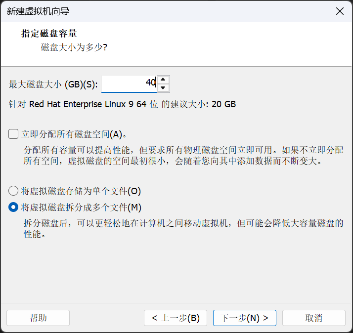

这里设置`最大磁盘大小`为**40GB**，你可以根据自己需求改大小

:::important[需要注意！]
下面这个复选框`立即分配所有磁盘空间`不建议选择，因为在你选择之后，创建的虚拟磁盘文件将直接占用你上面`最大磁盘大小`所填写的大小而不是从一个十分小的文件开始（按需分配）
:::

下面的`将虚拟磁盘存储为单个文件`和`将虚拟磁盘拆分成多个文件`个人建议选择前者，因为具有更好的磁盘性能，除非你的选择的存放虚拟磁盘的分区**不支持大于4G单个文件**（如Fat32）

然后继续下一步

`指定磁盘文件`磁盘文件名一般不用动它（要改也不是不行），直接下一步

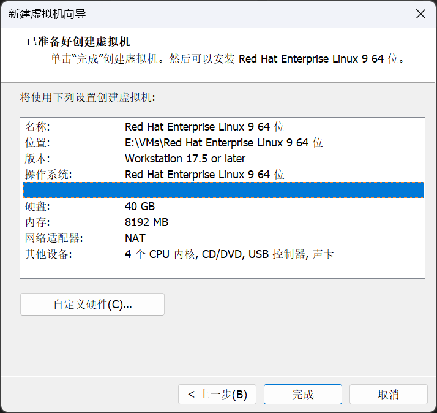

在这个页面检查你的配置是否正确，随后就可以点击`完成`了，结束虚拟机的创建

:::tip[提示]
如果你遇到了权限问题，请检查你的用户是否具有目标磁盘/目录的访问权限
:::

## 02 配置虚拟机载入镜像

在刚才创建完成之后，你应该已经返回了VMW的主界面

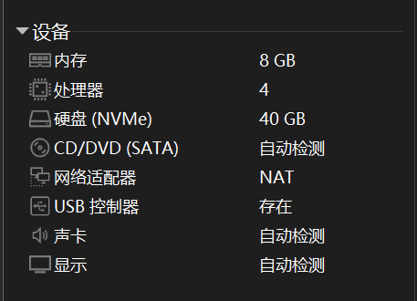

双击此处`CD/DVD`打开设置

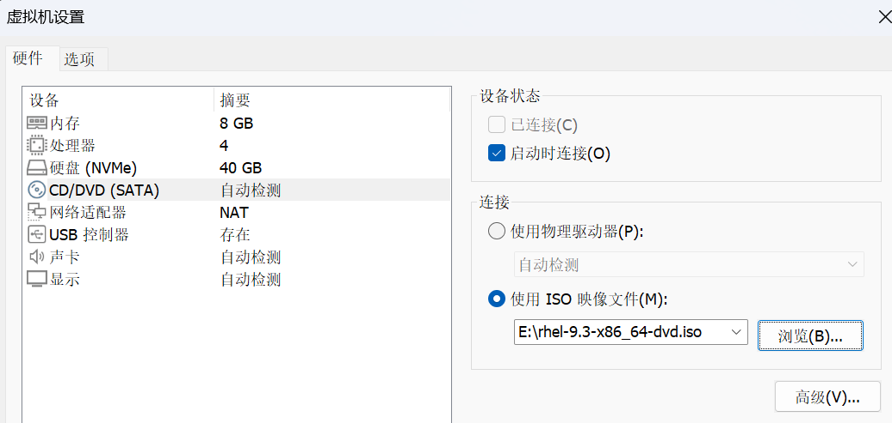

**确保**右上角`启动时连接`复选框已经勾选

然后下方`连接`选项卡选择`使用ISO映像文件`，并点击`浏览`选择你**事先准备好的Redhat镜像**

最后点击确定保存

## 03 启动虚拟机并安装系统

单击主页`开启此虚拟机`以启动

:::tip[提示]
如果你在启动过程中遇到了Hpyer-V测通道相关警告，则可以前往当前虚拟机的 **设置->选项->高级** 右侧面板中勾选`为启用了Hyper-V的主机禁用侧通道缓解`

**此为可选修复**
:::

### 在GRUB中选择安装选项

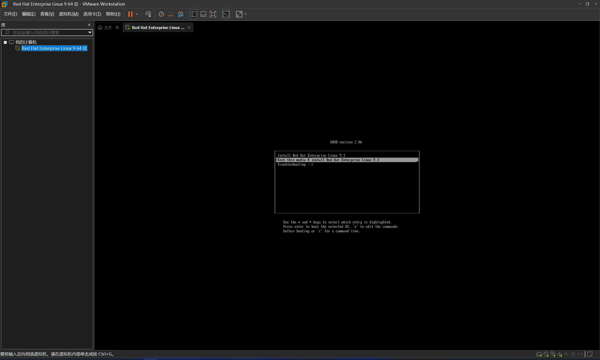

当进入此界面之后我们需要在一分钟之内手动点击虚拟机窗口以重定向键盘鼠标输入到虚拟机里面

:::tip[提示]
当键鼠被重定向锁定在虚拟机内时，可按**CTRL + ALT**来释放

未锁定时按**CTRL + G**则可以将输入锁定到虚拟机
:::

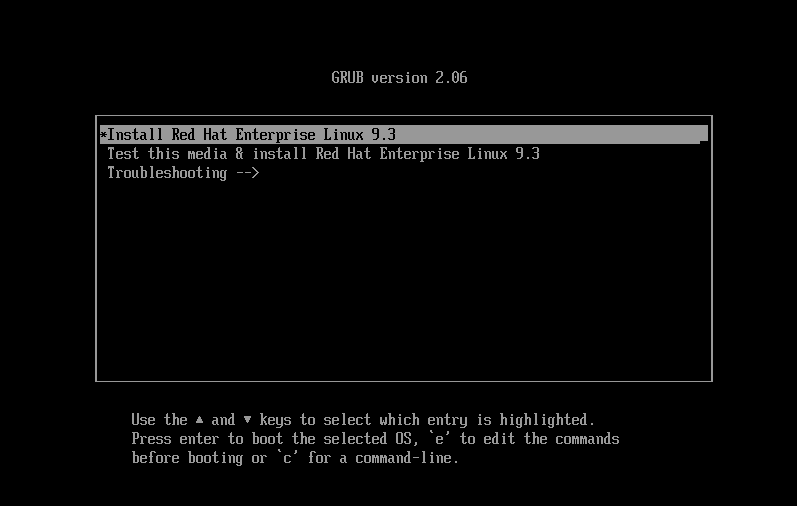

之后我们按方向键将选中移动到`Install Red Hat Enterprise Linux X`(其中`X`为你所使用镜像的具体版本号，此处是9.3)，然后按回车确认，并等待加载

### 语言选择

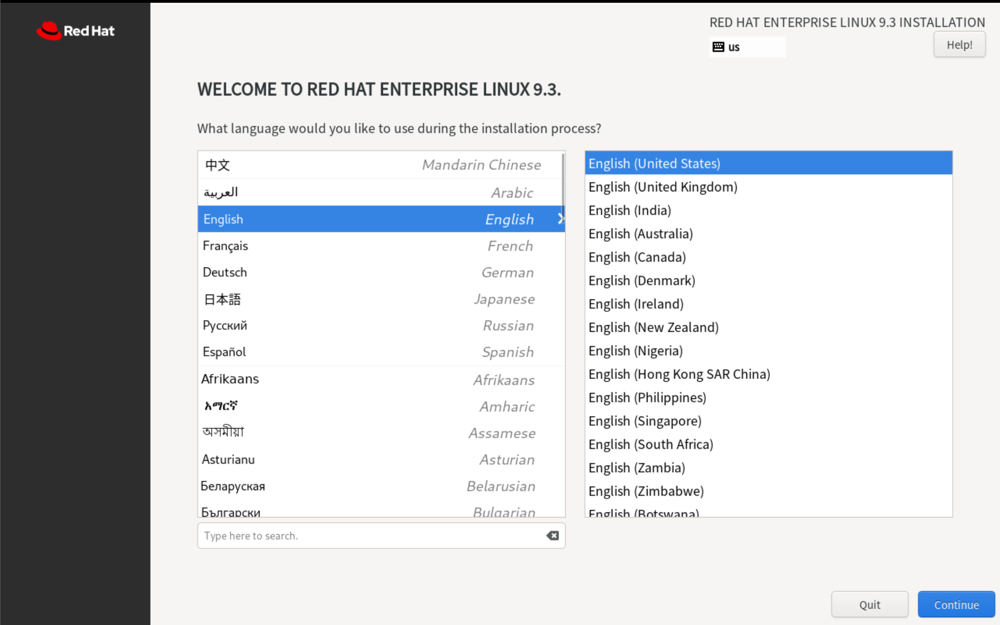

这是语言选择界面，直接继续

:::tip[提示]
应课程要求，此处使用英语安装，后续也是使用英语

你可以按照自己的喜好调整至中文
:::

### 首次进入安装主界面

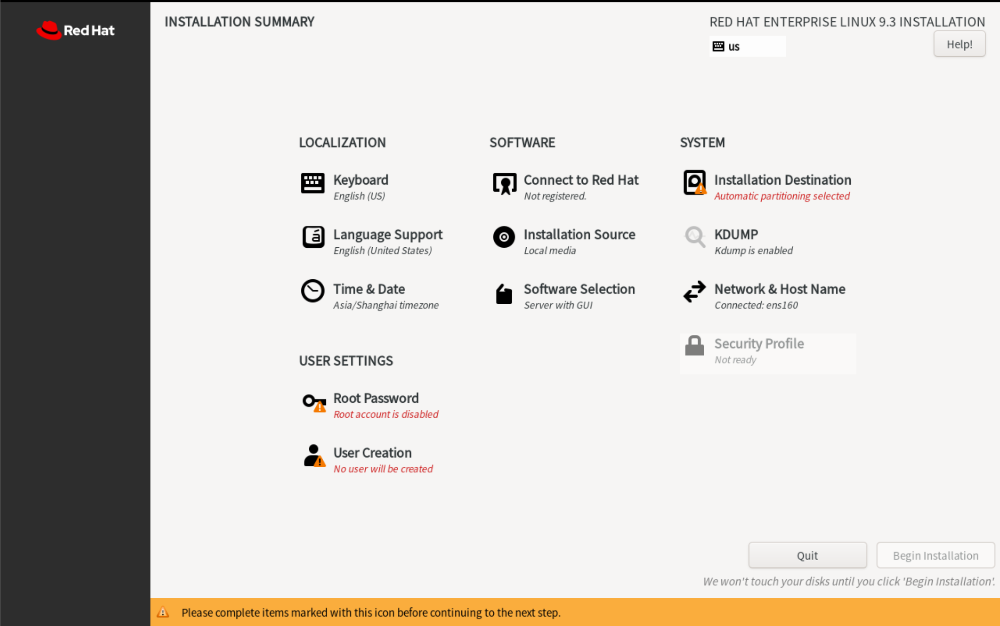

进入安装界面，在此处需要设置一些东西才能继续

### 设置时间

点击`Time & Date`

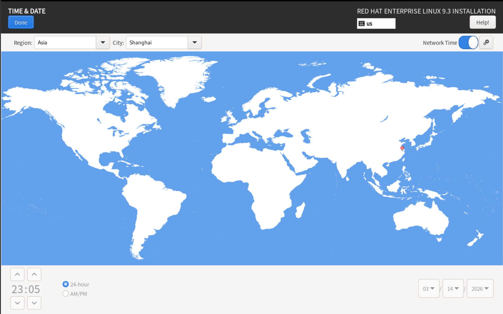

在上方`Regin`处选择你的区域，这里选择`Asia`(亚洲)

在`City`选择你的城市，这里选择`Shanghai`(上海 UTC+8)

完成之后点击左上角`Done`保存退出

### 设置安装位置

单击右上角`Installation Destination`以设置安装位置

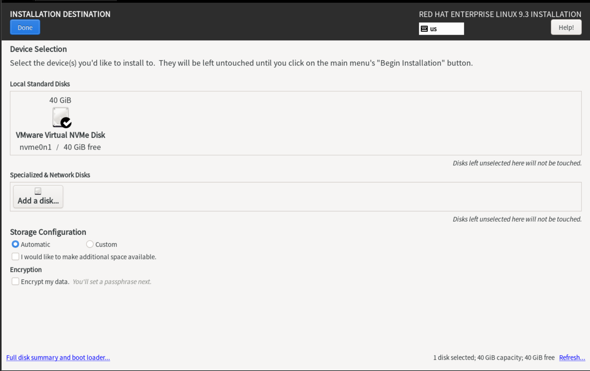

安装位置以及分区我们不需要动，保持默认自动划分就可以，因为我们使用的是一个空白的虚拟磁盘

直接单击左上角`Done`保存退出

### 配置网络

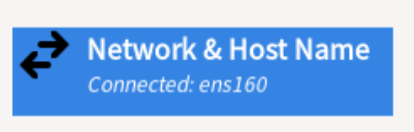

先查看此处是否`Connected`(已连接)，如果没有则需要进行手动配置网络，此类教程网上也很多，本文不再赘述

也可以点进去配置主机名，在里面`Host Name`区域设置你想要的主机名即可，完成后单击输入框旁边`Apply`应用更改，然后单击右上角`Done`保存退出

### 设置ROOT密码

单击主界面`Root Password`进入设置

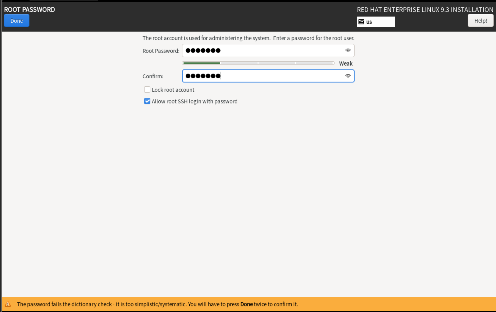

取消勾选`Lock root account`以**允许以Root登录**

勾选`Allow root SSH login with password`以**允许通过ssh来连接到虚拟机中的系统**

然后`Root Password`上面密码自己设置一个顺手能记住的然后在下方`Confirm`输入一次，之后单击左上角`Done`保存退出

:::important[需要注意！]
如果下方有如图所示的警告，证明你输入的**密码强度过低**或者**没有通过词典检查**，这个时候需要**点两次**`Done`才能保存退出
:::

### 创建普通用户

单击主界面`User Creation`以创建一个普通用户

:::note[为什么要创建普通用户？]
在Linux中，**Root**相当于Windows的**System**账户，比**Administrator**账户权限更高，具有系统的**最高权限**，我们日常操作肯定不能使用误操作风险很大的**Root**账户，所以需要创建一个**普通用户**来作为日常操作的载体，而且有部分软件是无法在Root下跑起来的(安全原因)
:::

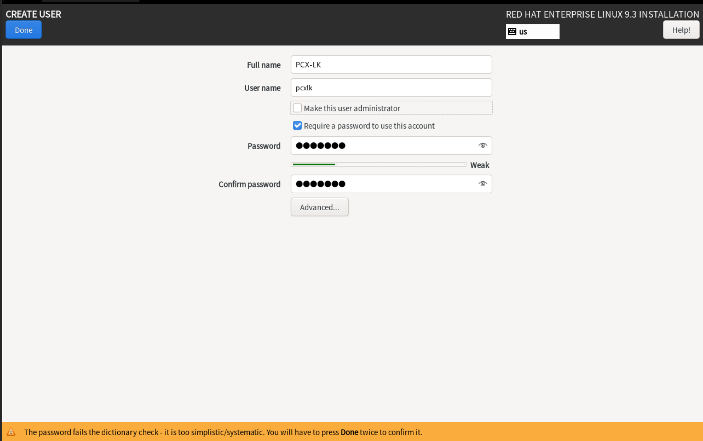

在`Full name`处直接输入用户名就好，会自动根据你的填写生成`User name`(一般为全小写)，当然之后你也可以自己更改

`Make this user administrator`复选框勾选之后会将这个普通用户放到sudo组里面，以让其可以通过sudo来执行命令，此处不勾选，如果需要可以自行勾选上，不勾也没关系，可以后面进再修改

下面密码的设置跟上面Root密码设置小节是一样的，不再赘述

:::important[需要注意！]
如果下方有如图所示的警告，证明你输入的**密码强度过低**或者**没有通过词典检查**，这个时候需要**点两次**`Done`才能保存退出
:::

### 安装系统

在前面的一切都完成之后，就可以开始启动安装了，单击主界面右下角`Begin Installation`即可

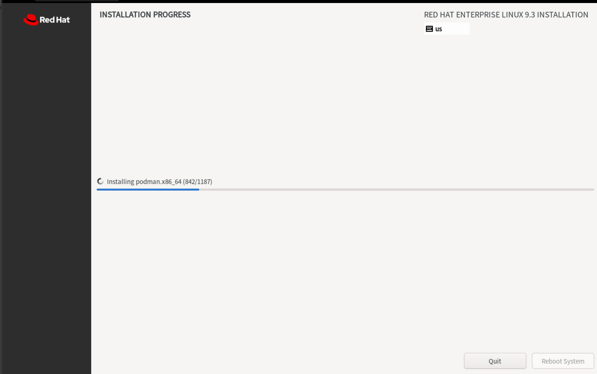

之后就是等待其自动分区，下载安装系统文件等

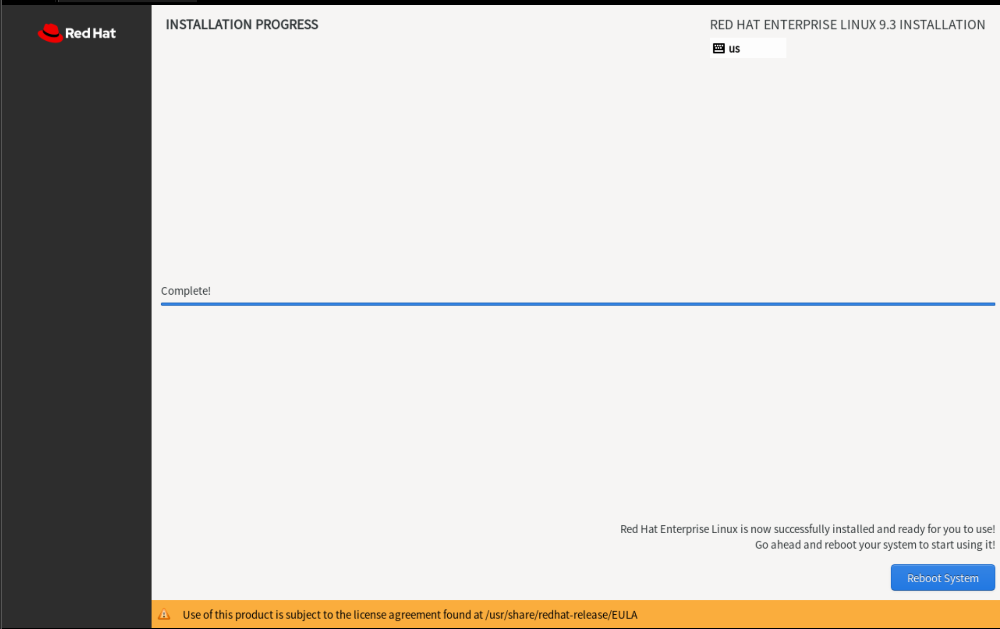

到这里就是安装完毕了，点击右下角`Reboot System`重启到新安装的系统

## 04 验证系统

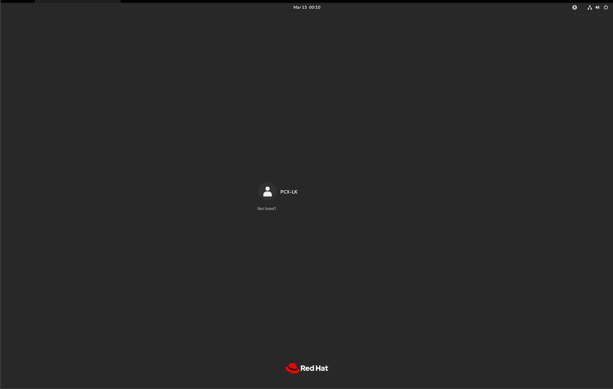

到这个界面就证明你的系统安装没有问题

单击你的用户（此处我是PCX-LK）来登录到你的系统

如果你想要登录Root账户，则需要先点击`Not listed?`，再手动输入`root`和密码来登录

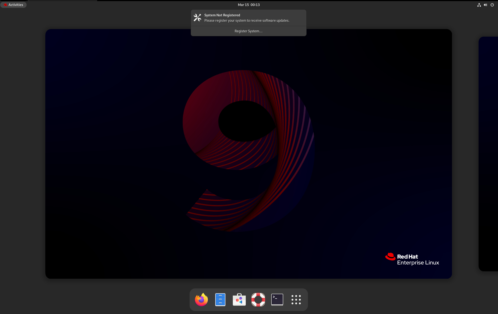

到此就成功进入系统了

## 05 给当前系统拍个快照

拍摄一个快照以备后面不小心损坏了系统之后的快速恢复

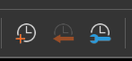

点击VMW顶上工具栏里面那个带橙色加号的时钟按钮以添加快照

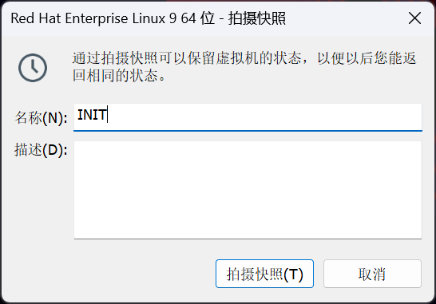

可以自己随便起个名字，然后点击`拍摄快照`就可以保存当前系统的状态了

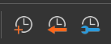

现在第二个图标也就亮起来了，用于快速退回到上一个快照

第三个按钮则用于管理快照

左边的暂停图标(此处图片未列出)可以将虚拟机挂起，下次启动的时候可以直接以挂起前的状态开机而无须等待开机

方块图标则是关机，可以选择强制关机或者普通关机，在虚拟机无法正常关机的时候很有用

## 06 结尾以及碎碎念

第一次课的内容就这么多了，东西还是很基础的，对于我这种已经用过好几年Linux的人来说轻而易举啊（:spoiler[BTW I use Archlinux]

Redhat默认是GNOME差评，个人觉得GNOME过于:spoiler[奇异搞笑]，还是只有Windows-like的KDE用着舒服，比GNOME轻量（应该），自定义性也比GNOME高

:spoiler[第一次课前一讲就抽到我了（难蚌），下节课课前要讲点神秘小内容，准备给大伙来点神秘Linux用户震撼（不是）]
