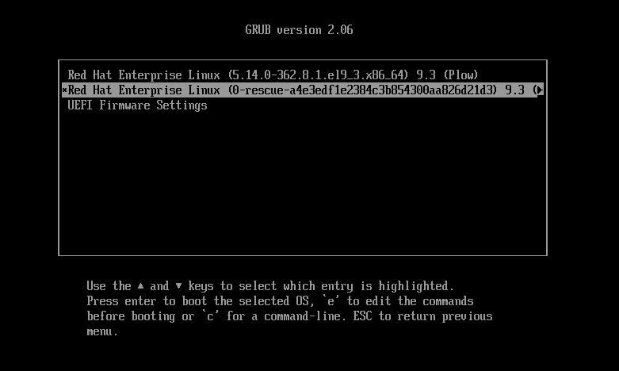
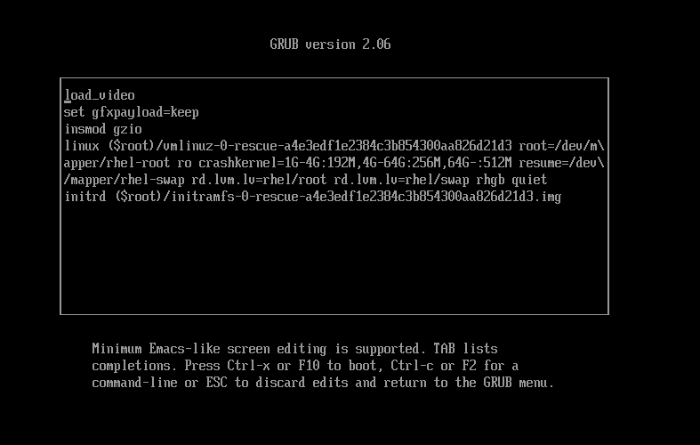
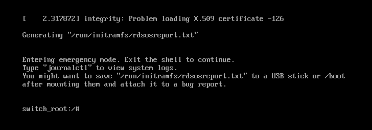
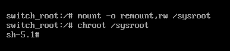
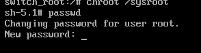

## 00 前言

在各种Linux的使用之中，忘记密码是常有的事

本文记录一种在Redhat发行版下可用的重置方式

:spolder[我觉得这种方法比较复杂，对于仅运行在无头界面的服务器较为适用，正常Linux桌面用户更常用的方法是LiveCD chroot直接passwd修改]

依旧以虚拟机的Redhat 9.3为例

## 01 Root

### 01-01 启动到GRUB

打开Redhat虚拟机，如果已经在运行则需要重启



来到grub界面之后，快速确保键鼠输入重定向到了虚拟机里面，按上下方向键以取消倒计时，然后将光标移动到带有`rescue`的选项上

之后按按照下方提示按键盘上`E`键以编辑启动命令行



然后将光标移动到`linux`开头这一行的行尾(`quiet`后面)，空格输入

```
rd.break
```

:::tip[关于`linux`开头的这一行]
这是决定**Linux Kernel**启动的参数行，其后的内容会**直接传递给内核**，以告诉内核需要执行的一些操作
:::

:::tip[关于`rd.break`]
根据我个人的了解，此命令行参数适用于**基于Systemd的发行版**
它告诉内核在从Initramfs切换到真实rootfs之前**暂停**，之后提供一个暂时紧急命令行，它具有root权限，可以让我们进行一些修复操作
:::

:::tip[提示]
在GRUB中的任何更改只对单次引导有效，下次启动依旧会保持原有参数启动，如需要持久化则需要修改默认GRUB配置文件并重新生成
:::

输入完成之后，按照下方提示按**CTRL + X**或者**F10**以按照当前命令参数开始引导

### 01-02 进入救援模式Shell并重置密码



等待启动来到这个Shell界面之后，开始执行修改Root密码的操作

#### 将系统rootfs重新挂载为可读写

我们先将系统的rootfs设置为可读写状态，执行以下命令

```bash
mount -o remount,rw /sysroot
```

:::tip[提示]
`mount`指令是Linux中**负责文件系统挂载**的指令
`-o`后面接的是**挂载参数**，使用`,`分隔，`remount`告诉mount**重新挂载目标文件系统**，`rw`表示**可读可写**
最后就是目标文件系统的路径了，可以是已经挂载的路径，也可以是块设备的路径
:::

#### chroot进入到系统rootfs

执行以下命令以切换到系统的rootfs内

```bash
chroot /sysroot
```

:::tip[提示]
`chroot`指令用来切换当前的rootfs，可以直接绕过密码直接进入目标rootfs系统
:::



到了这一步我们发现shell提示变了，这证明我们成功进入到了系统的rootfs中，并且此时我们可以操作rootfs中的内容

#### 修改root密码

执行以下指令

```bash
passwd
```

:::tip[提示]
`passwd`是Linux中用于修改用户密码的指令，当无参执行时，默认修改当前用户的密码
:::



出现提示输入新密码的提示，此时输入新的密码完成之后回车即可

:::tip[提示]
在Unix和Linux中，很多在cli(命令行界面)中输入密码或者密钥的时候，用户的输入并不会回显出来，这是正常情况，继续输入即可
:::

然后提示需要再次确认一次密码，按照原样继续输入一次然后回车即可

#### 刷新SeLinux安全上下文

在改完密码之后我们还需要告诉SeLinux我们更改系统文件了（此时SeLinux并未正常加载，无法记录我们的操作）

运行以下命令

```bash
touch /.autorelabel
```

:::tip[提示]
`touch`是Linux下在不写入内容的情况下创建文件的指令，参数为目标文件路径
:::

:::tip[提示]
`/.autorelabel`在系统正常加载之后会自动被SeLinux检测到，随后重建安全上下文以及重置系统文件的SeLinux标签，随即移除
:::

#### 重启系统

我们直接在当前Shell中运行两次`exit`或者按两次**CTRL + D**以退出两次Shell（第一次是Chroot环境，第二次是救援Shell），系统便会继续引导到rootfs

Root密码的修改就完成了，可以登录测试

## 02 普通用户

### 02-01 登录Root用户

我们可以通过两种方式登录到root

1. 通过**会话管理器**(也就是进入系统后叫你登录用户的地方)来登录到Root
    - 单击`Not listed`之后输入`root`来登录到root
2. 先通过**会话管理器**登录到**普通用户**再通过`su`指令切换到root(或者`sudo`临时获取root权限)
    - `su`用于切换当前Shell用户，直接在普通用户的终端输入它并输入密码，当无参执行时，默认切换到root用户
    - 关于`sudo`的方法此处仅简要提示: `sudo passwd <用户名>`

完成上述操作后，便可以开始普通用户密码的重置

### 02-02 开始重置密码

通过上述方法切换到root之后，需要在终端执行

```bash
passwd <username>
```

操作与Root小节的方法一致，只不过需要在`passwd`命令后显示指出修改的是哪个用户的密码

之后就可以登出再登入来查看密码是否修改生效了
