## 00 前言

本章概览：

 - 创建三种类型的磁盘

 - 在三块磁盘上创建三种不同的文件系统

 - 使用MBR与GPT两种分区表进行分区

## 01 在VMW中创建虚拟磁盘

打开VMW并且打开虚拟机的设置界面

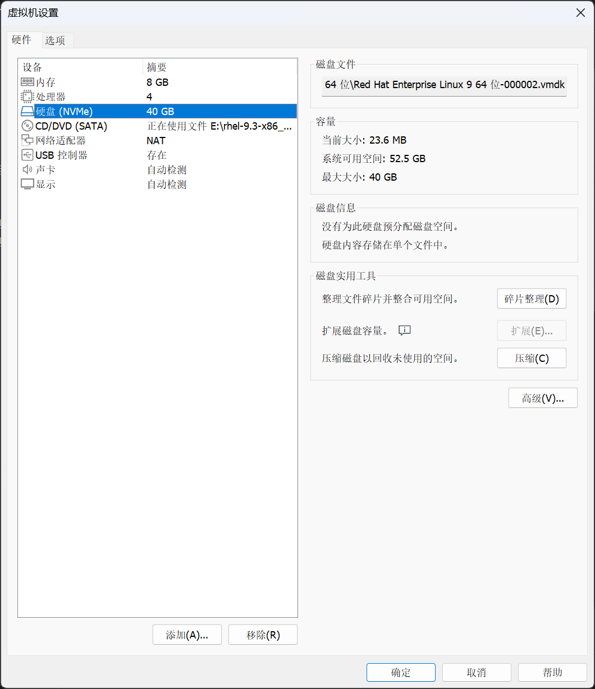

点击下方`添加(A)`，添加`硬盘`

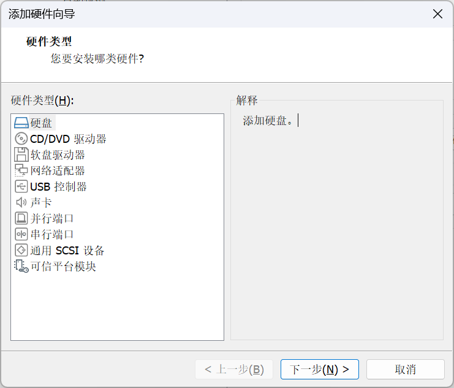

选择`SCSI(S)`

:::note[注意！]
后续重复操作将在此页面继续创建`SATA`与`NVME`类型的磁盘，重复步骤不多赘述
:::

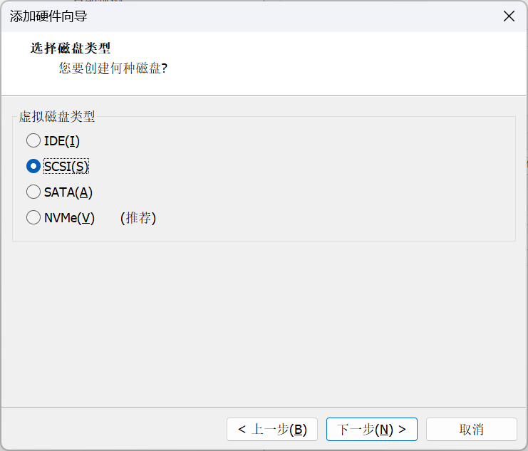

选择`创建新虚拟磁盘(V)`

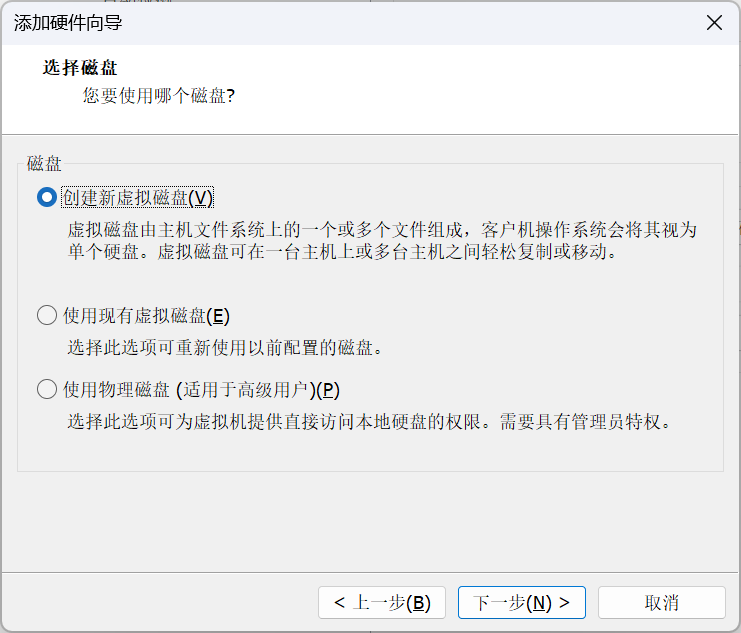

供教程所用这里我就只创建1GB大小的磁盘

建议选择`将虚拟磁盘存储为单个文件(O)`以提升IO性能

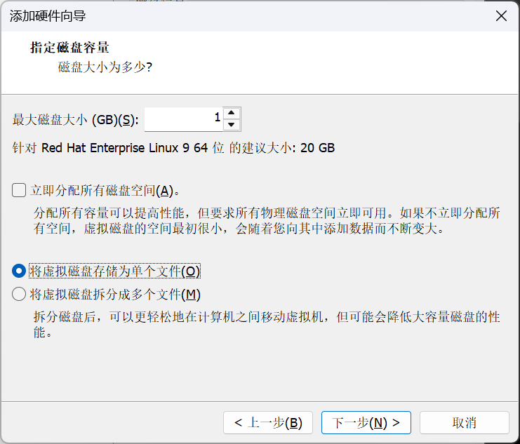

以磁盘类型命名(当然你想命名成其他的玩意也可以，这里纯方便辨别)

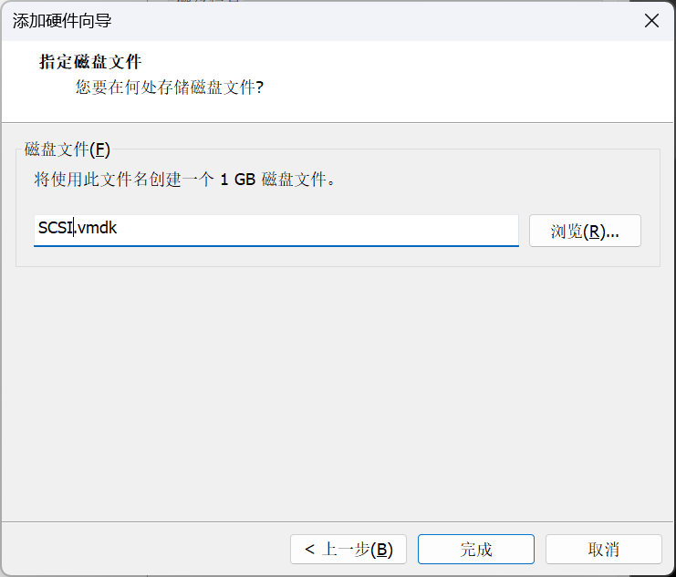

重复上述步骤创建其他两个类型的磁盘(`SATA` `NVME`)，最后创建完后应该具有如图所示的磁盘

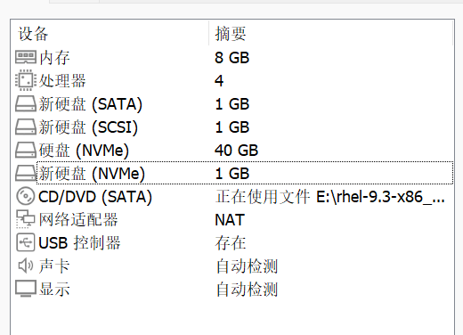

## 02 开始分区

启动虚拟机，准备开始分区

通过`lsblk -o NAME,TRAN1` 查看磁盘块设备文件名以及对应接口类型

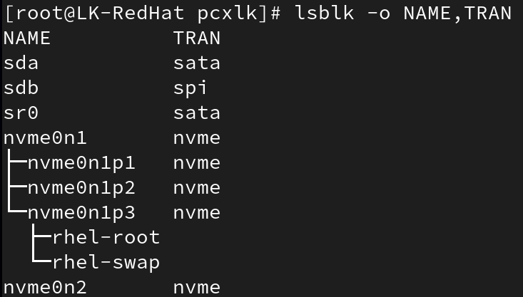

可知我们刚才创建的三个磁盘的对应块设备是：
 - sda (SATA)
 - sdb (SCSI)
 - nvme0n2 (NVME)

### 02-01 对SCSI硬盘分区

#### 创建MBR分区表

由于是空硬盘，所以我们先创建一个分区表

执行`fdisk /dev/sdb`并输入`o`(创建MBR分区表) 指令回车确认

:::important[需要注意！]
此处多余操作手动了一次`o`操作，其实这是没有必要的
`fdisk` 默认在操作没有分区表的磁盘时会自动创建MBR(DOS)分区表
:::

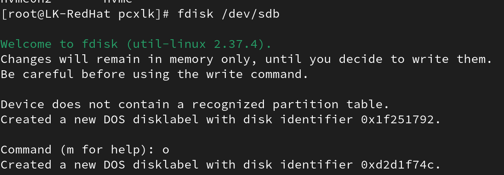

#### 创建两个主分区

继续在`fdisk`中输入`n`(添加新分区)指令

提示创建分区类型，此处选择`p`(主分区)

提示分区号，默认1，回车

提示初始扇区号，保持默认，回车

提示结束扇区号，此处我使用`+512MiB`(往后递增512MiB个扇区)创建一个512MiB的分区

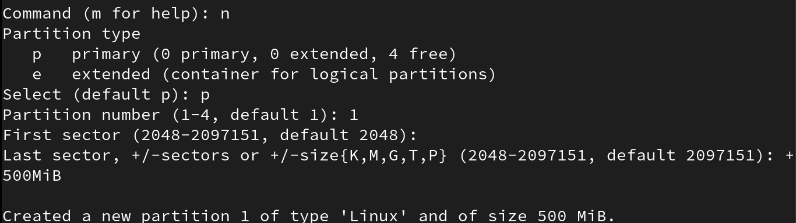

重复上述操作，注意本次操作结束扇区号保持默认

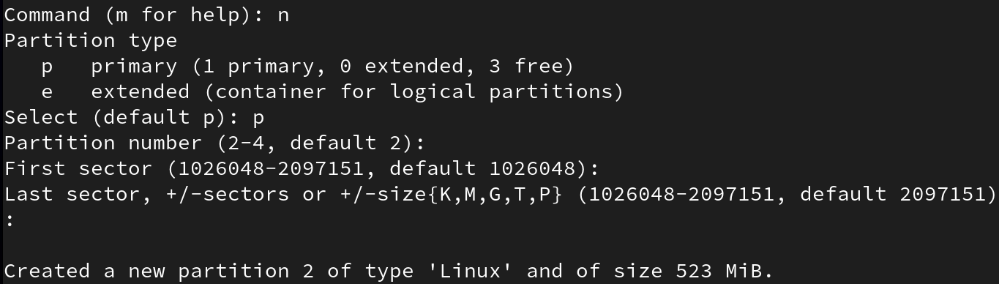

至此我们已经成功创建两个分区，现在执行`w`(写入并退出)写入操作保存退出

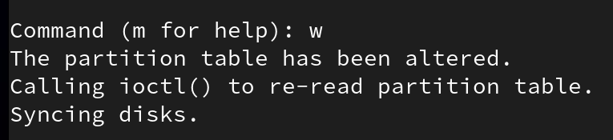

#### 格式化创建好的分区

我们使用`mkfs`工具进行格式化

:::note[关于mkfs]
这是一个支持多种文件系统格式的文件系统创建工具
支持`cramfs ext2  ext3 ext4 fat minix msdos vfat xfs`等文件系统
:::

这里创建一个`ext2`和`ext3`文件系统

先`lsblk`查看现在的分区状态

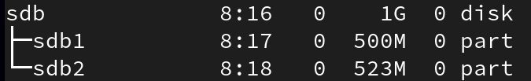

**注意到**在上一小节中创建的分区是`sdb1`以及`sdb2`

使用`mkfs.ext2`和`mkfs.ext3`进行格式化

执行`mkfs.ext2 /dev/sdb1`

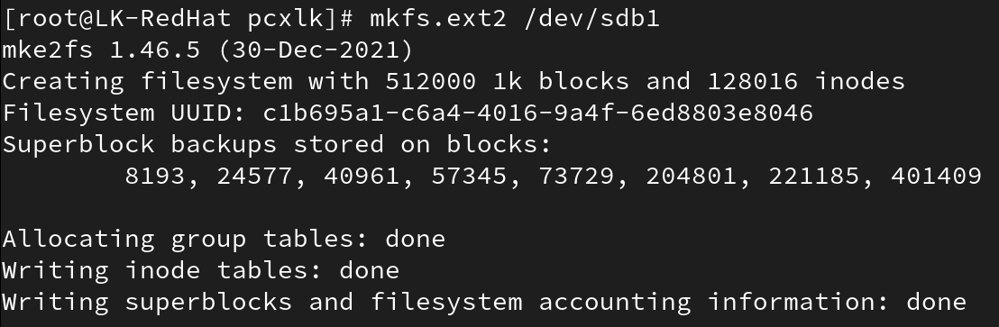

执行`mkfs.ext3 /dev/sdb2`

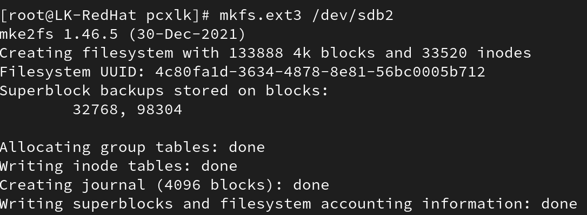

至此两个分区已经格式化完毕

#### 挂载两个分区并进行测试

使用`mount`指令进行挂载

把`/dev/sdb1` 挂载到`/guazai1`
把`/dev/sdb2` 挂载到`/guazai2`

创建挂载点以及挂载

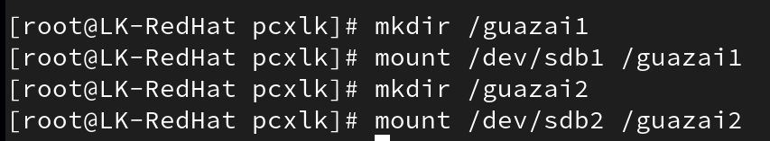

然后在上面创建文件再随便写点什么

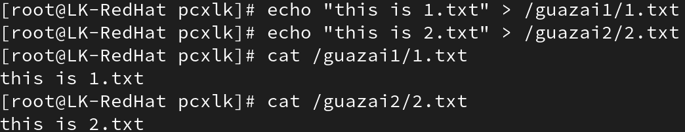

至此，对SCSI硬盘的分区就完成了

:::note[注意]
后续重复操作我就不过多说明了
:::

### 02-02 对SATA硬盘分区

#### 创建一个主分区和扩展分区以及一个逻辑分区

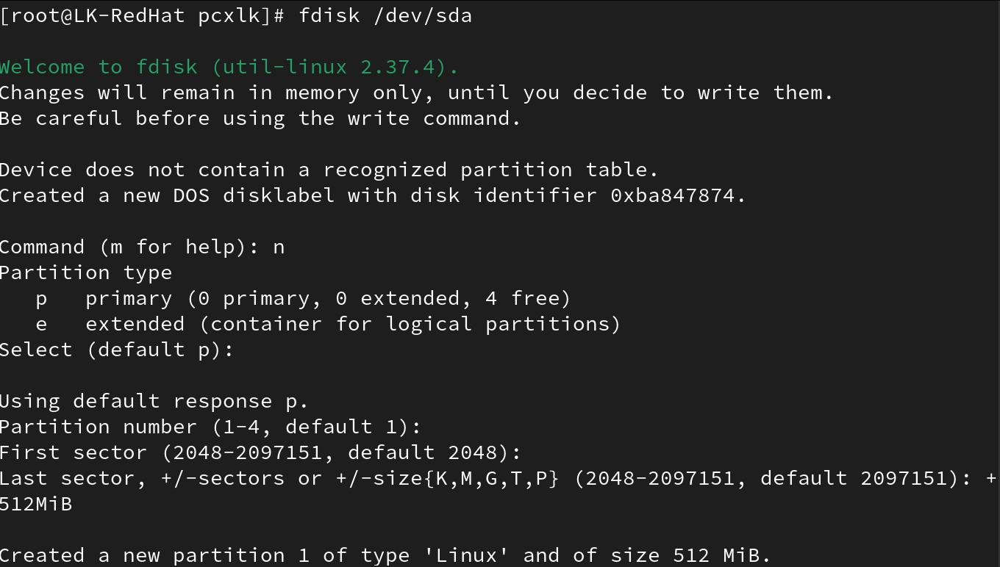

第二个创建扩展分区而不是主分区，使用`e`(扩展分区)

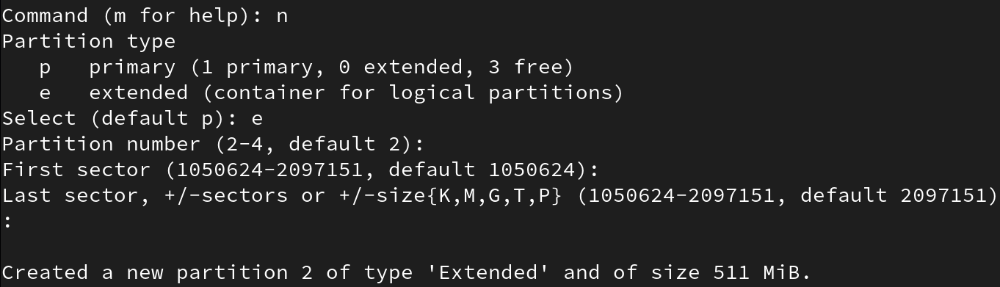

最后写入退出

再次执行`fdisk /dev/sda` 进行逻辑分区的创建

创建一个100MiB的逻辑分区

:::important[需要注意！]
此处有错误，请最少创建300MiB的分区，不要创建100MiB的分区
:::

最后写入退出

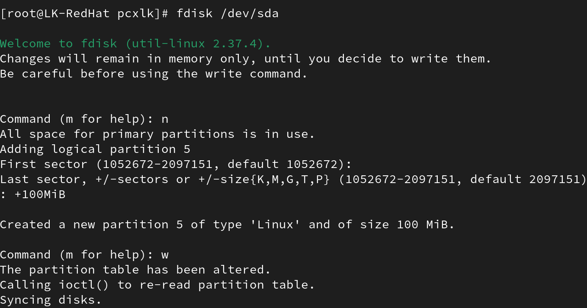

#### 格式化创建好的分区

主分区格式化为`ext4` ，逻辑分区格式化`xfs`

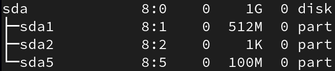

其中只有1k大小的`sda2`是扩展分区，`sda1`主分区，`sda5`逻辑分区

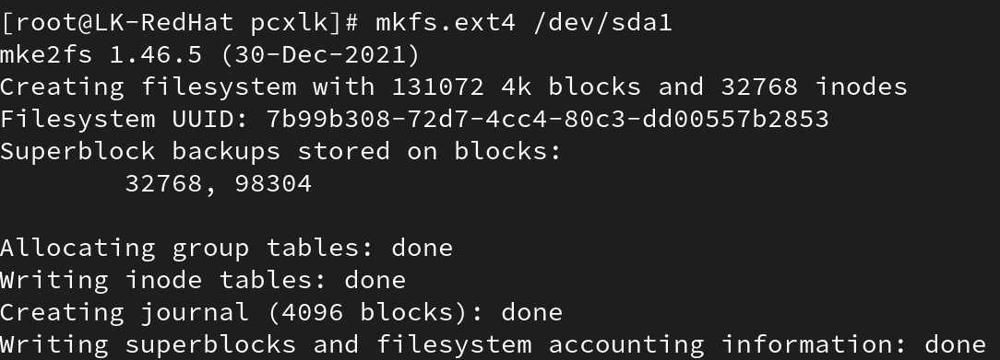

注意到格式化xfs时提示分区大小必须大于300MiB,重新创建一下

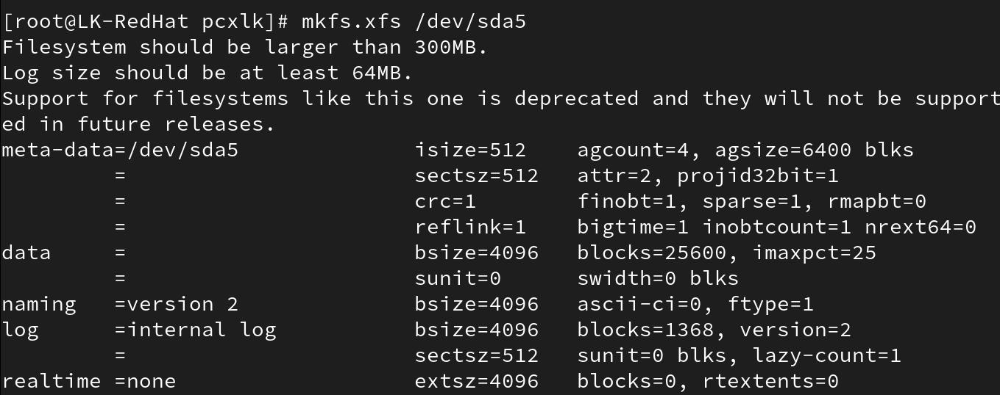

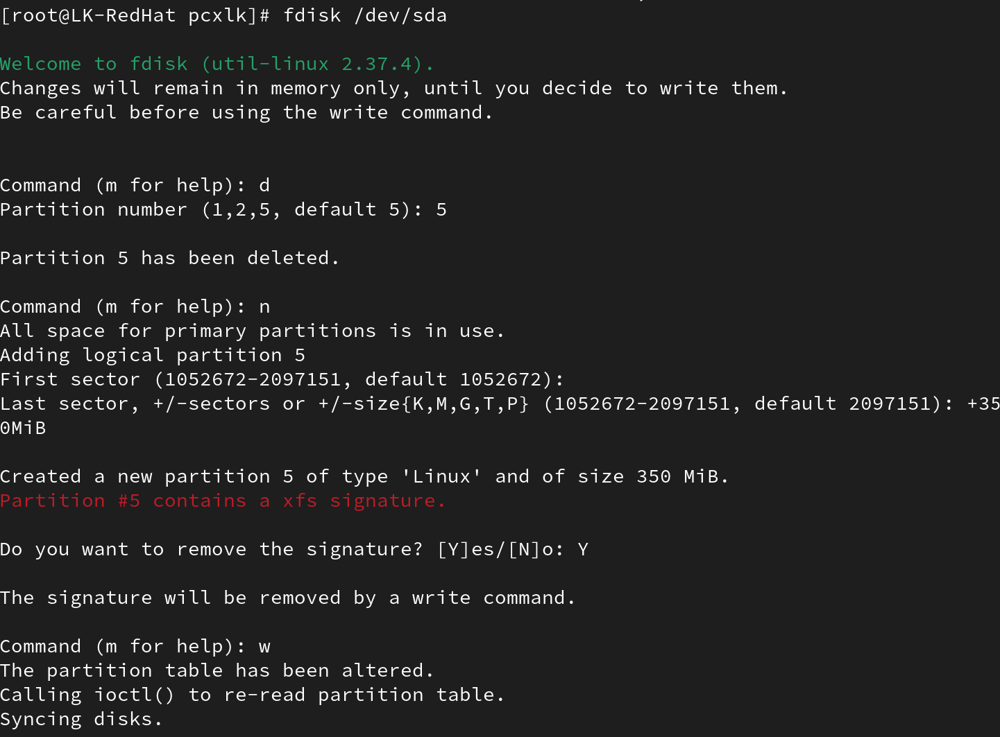

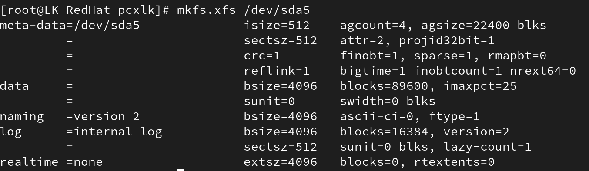

#### 挂载并测试

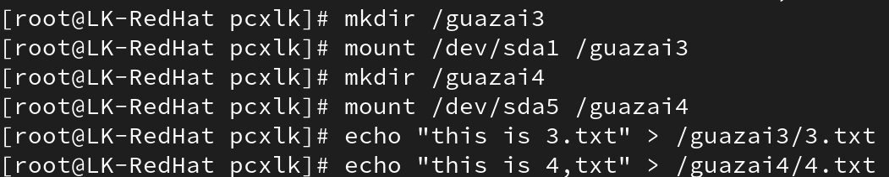

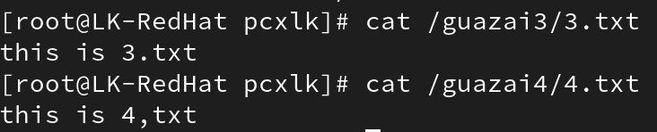

### 02-03 对NVME硬盘分区

#### 创建GPT分区表并且创建一个主分区

先使用`g`(创建GPT分区表)指令创建GPT分区表，其他跟上面的小节无异

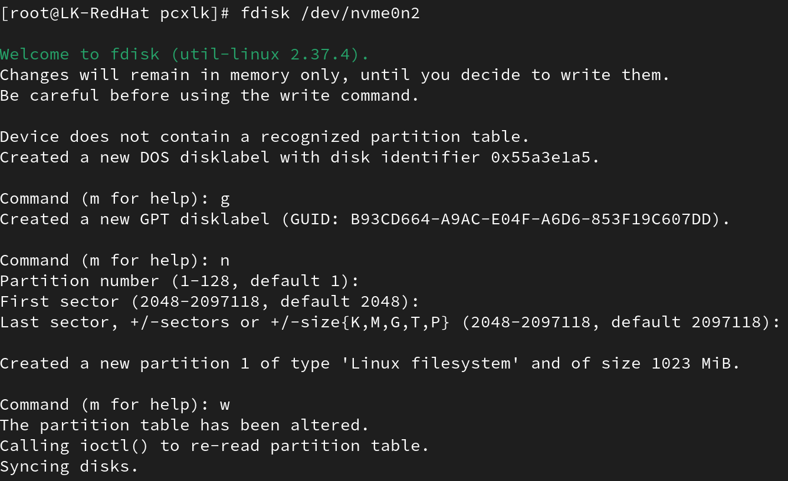

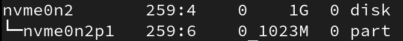

#### 格式化创建好的分区

将其格式化为`xfs`文件系统

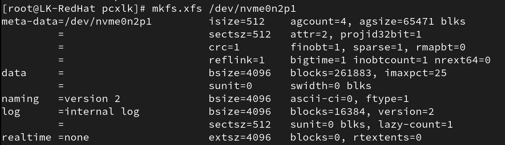

#### 挂载并测试

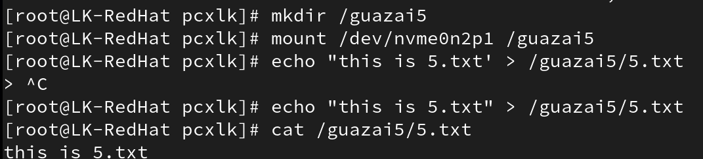

## 03 结语

非常基本的Linux分区操作，不过还有更多分区方式可以选用

比如tui版本的`cfdisk`，图形化的`GParted`或者KDE家的`partitionmanager`，另一个cli的`parted`

图形化方式一般可以同时分区和格式化，纯cli的一般是分区格式化分开
