### 00 前言

绝大多数Linux发行版的网络后端都是NetworkManager，本章介绍一些基础方法来管理网络连接

本章概览：

 - 通过nmcli/nmtui创建/删除网络连接

     - 创建DHCP/手动连接

 - 通过nmcli查看网络连接信息

 - Extra: wget curl的简单应用


### 01 创建新连接

#### 01-1 通过nmcli

##### 创建DHCP连接

在终端模拟器中执行以下指令以创建一个

 - 连接名为`ens201`

 - 连接类型为`ethernet`(以太网)

 - DHCP

的连接

```bash
nmcli c add type ethernet con-name ens201 ipv4.method auto
```

:::note[这是什么]
关于nmcli (NetworkManger的cli管理工具) 的一些参数

`c` : `connect` 的单字母缩写
`add` : 添加连接
   - `type` : 连接类型
     - `ethernet` 以太网，也就是常见的**有线连接**
   - `con-name` : 连接名称，可以是任意字符串
   - `ipv4.method` : `ipv4` 选项中的 `method` (获取方式) 字段，用于控制ip地址、dns地址、网关地址的获取方式
     - `auto` 也就是DHCP方式
     - `manual` 手动填写，需要后续继续填写`ipv4` 选项的 `addresses` `gateway` `dns` 字段
   - `autoconnect` : 此连接是否自动连接，可使用`no` `yes`
`up` : 激活连接
:::

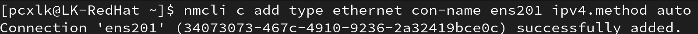

输出如上图就是创建好了，不过我们还需要手动启用这个连接，默认不自动连接

终端模拟器执行

```bash
nmcli c up ens201
```
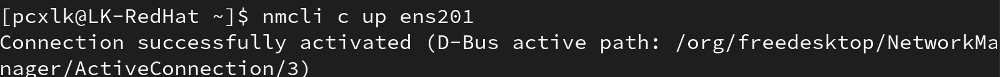

输出如上图就是启用了

##### 创建手动连接

在终端模拟器中执行以下指令以创建一个

 - 连接名为`ens202`

 - 连接类型为`ethernet`

 - 手动配置

     - 地址为`192.168.114.114/24`
  
     - 网关为`192.168.114.1`
  
     - DNS为`192.168.114.1`

的连接

然后启用它
```bash
nmcli c add type ethernet con-name ens202 ipv4.method manual ipv4.addresses 192.168.114.114/24 ipv4.gateway 192.168.114.1 ipv4.dns 192.168.114.1
```

```bash
nmcli c up ens202
```

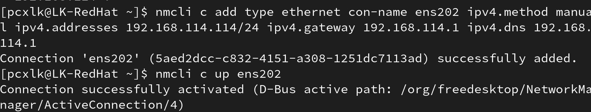


#### 01-2 通过nmtui创建手动连接

直接在终端中执行`nmtui`打开NetworkManager的终端用户界面

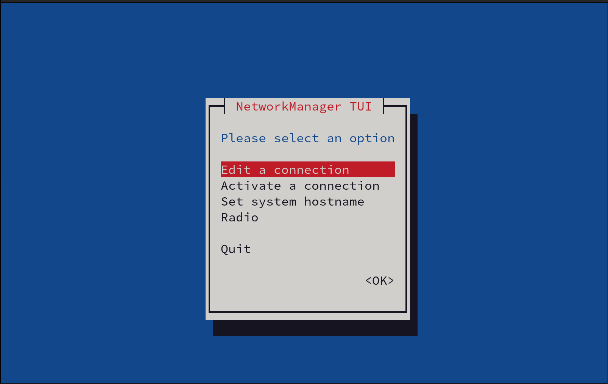

通过方向键移动到`Edit a connection`然后回车确认以编辑连接


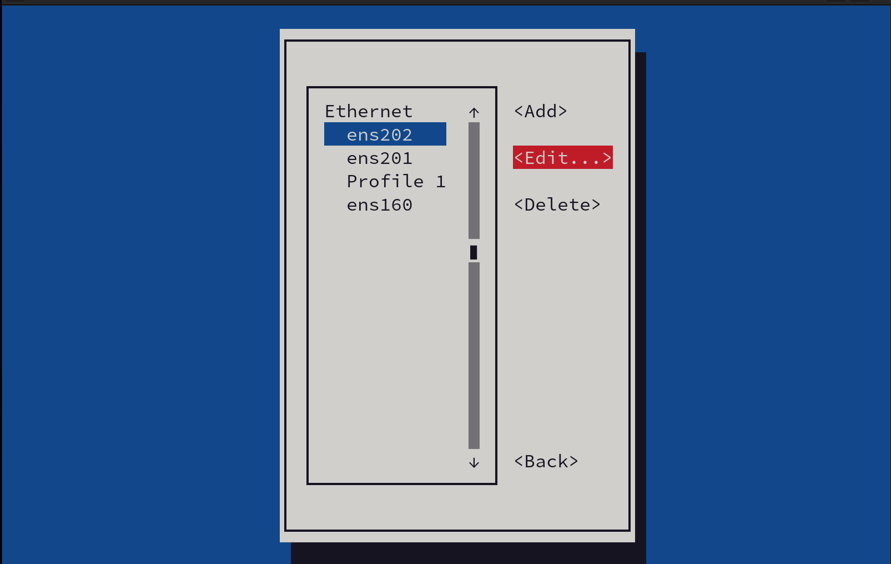

在此处可以看见系统上面的所有连接，也包括我们之前刚创建的连接

移动到`Add`上并回车以新建连接

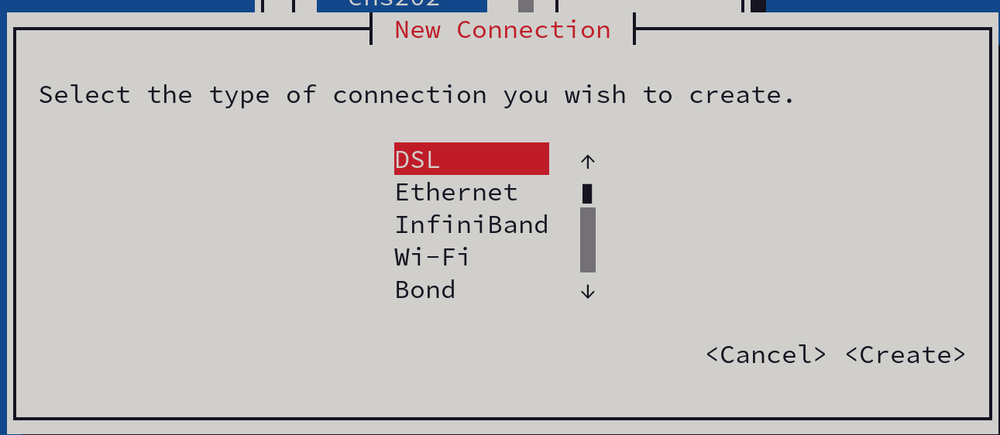

按方向键选择`Ethernet`创建有线网络，回车确认

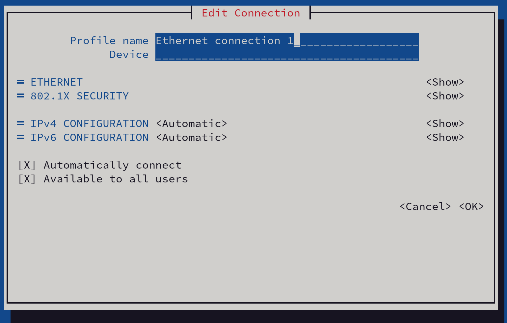

进入配置界面

在`Profile name`处填入连接名称

然后移动到`IPv4 CONFIGURATION`后的`<Automatic>`处回车，将其设置为`Manual`

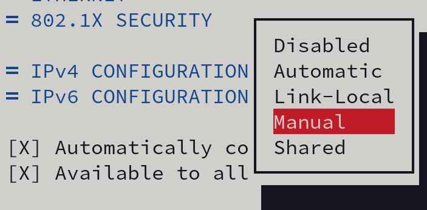

然后移动到同行的`<Show>`处，回车展开配置菜单

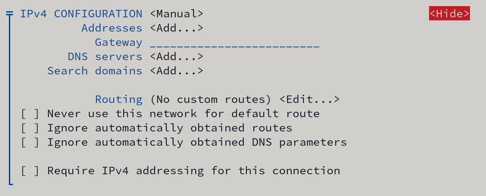

分别移动到`Address` `Gateway` `DNS servers` 处以添加地址、网关和DNS服务器

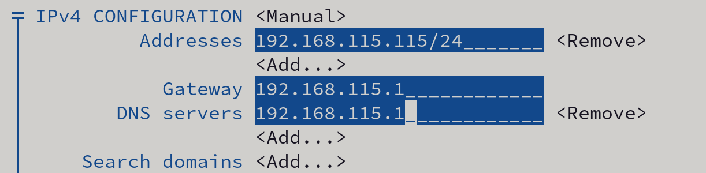

完成之后就可以按方向键移动到右下角`<OK>`回车完成添加

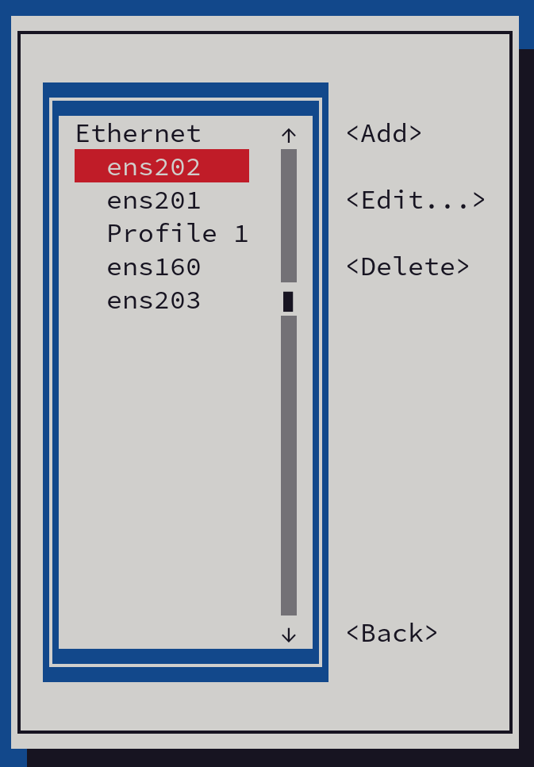

可以看到我们添加的连接

按ESC键返回，选择`Activate a connection`回车进入

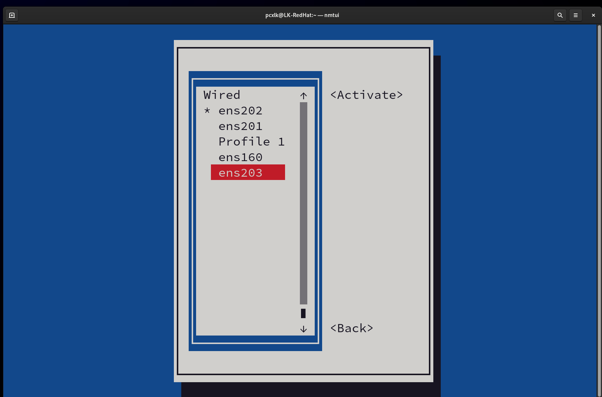

移动到刚才创建的连接，回车以激活

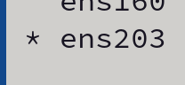

### 02 通过nmcli查看连接信息/删除连接

可以通过以下指令查看连接信息

```bash
nmcli c show CONNECTION_NAME
```

`nmcli c show ens203`

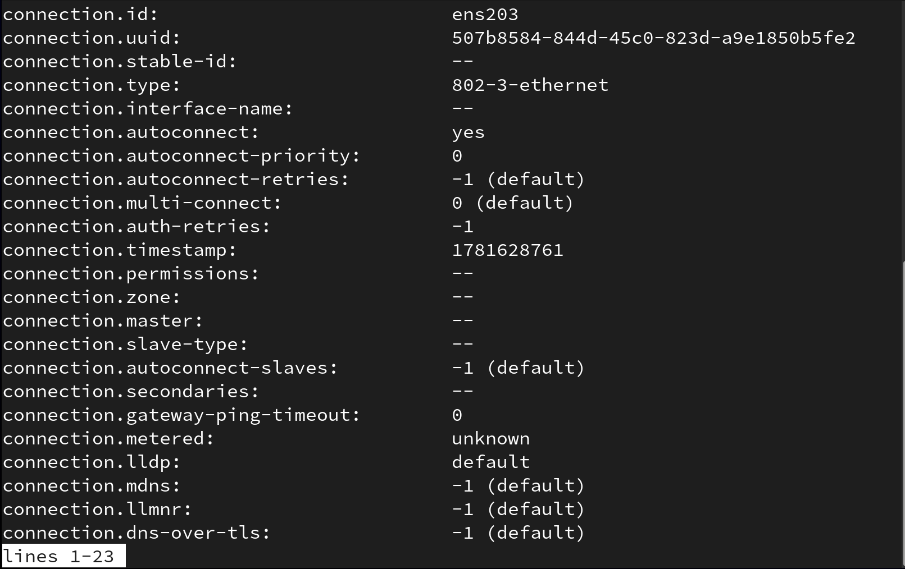


通过以下指令删除连接

```bash
nmcli c delete CONNECTION_NAME
```

`nmcli c delete ens202`

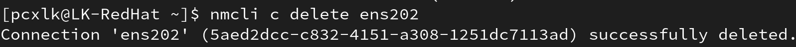

### Extra 通过wget curl下载文件

#### wget

示例链接: `https://www.rpmfind.net/linux/almalinux/8.10/AppStream/x86/_64/os/Packages/java-1.8.0-openjdk-1.8.0.472.b08-1.el8/_10.x86/_64.rpm`

```bash
wget URL_TO_FILE
```

`wget https://www.rpmfind.net/linux/almalinux/8.10/AppStream/x86/_64/os/Packages/java-1.8.0-openjdk-1.8.0.472.b08-1.el8/_10.x86/_64.rpm`

#### curl

示例网页: `https://bilibili.com`

```bash
curl URL_TO_RRSOURCE
```

`curl https://bilibili.com`

### 结语

通过`nmcli` `nmtui` 可以很方便的管理网络后端基于NetworkManager的发行版的网络

几乎所有的DE都有自己的兼容NetwokManager的GUI界面管理器，所以也可以通过图形界面进行网络配置
